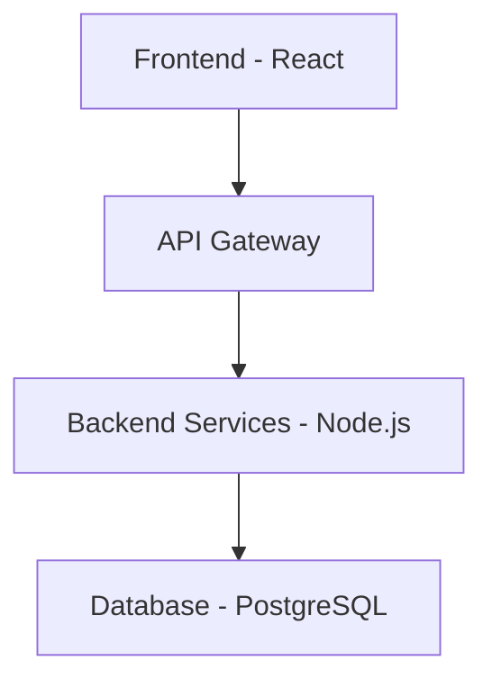

# Stable Flow - Agentic Coding Documentation

<div align="center">

**AI-Powered Documentation Generation for Software Projects**

[](https://python.org)
[](https://opensource.org/licenses/MIT)
[](tests/)
[](htmlcov/)

*Streamlined documentation that scales with your team and adapts to your workflow.*

[Quick Start](#quick-start) • [Features](#features) • [Installation](#installation) • [Documentation](#documentation)

</div>

---

## 🎯 What is Stable Flow?

Stable Flow is a comprehensive documentation generation system designed specifically for AI-assisted software development. It creates professional, consistent documentation that adapts to your project's complexity and team needs.

### Key Benefits

- **🤖 AI-Optimized**: Written specifically for AI models to understand and extend
- **📈 Scalable**: Four tiers from solo developer to enterprise teams
- **🔧 Customizable**: Granular control over every aspect of documentation
- **🚀 Fast**: Generate complete documentation suites in minutes
- **🔄 Consistent**: Maintains consistency across all project documents
- **📚 Comprehensive**: Covers all aspects of software project documentation

## Features

### 📋 Documentation Tiers

| Tier | Complexity | Best For | Documents | Key Features |
|------|------------|----------|-----------|--------------|
| **Minimal** | Low | Solo developers, small projects | 3 core docs | Quick setup, essential documentation |
| **Core** | Medium | Small teams, standard projects | 6 core docs | Sprint planning, coding standards |
| **Advanced** | High | Large teams, enterprises | 11+ docs | Compliance, security, performance tracking |
| **Custom** | Variable | Specialized needs | User-defined | Complete customization |

### 🛠️ Core Capabilities

- **Template Processing**: Jinja2-based document generation with conditional logic
- **Configuration Management**: YAML-based configuration with validation
- **AI Integration**: Built-in prompts and guidelines for AI assistants
- **Cascade Updates**: Automatic cross-document consistency
- **Multi-format Output**: Markdown, CSV, and extensible formats
- **CLI Interface**: Command-line tools for all operations

### 📚 Generated Documents

#### Core Documents (All Tiers)
- **Product Requirements Document (PRD)**: Features, user stories, acceptance criteria
- **Technical Design Document**: Architecture, technology stack, data models
- **Features CSV**: Feature tracking with business metrics

#### Core Tier Additions
- **Development Guide**: Coding standards, testing, performance guidelines
- **Sprint Planning**: Multi-sprint roadmap and capacity planning
- **Sprint Template**: Individual sprint execution and tracking

#### Advanced Tier Additions
- **Master Index**: Cross-referenced documentation hub
- **Security Audit**: Compliance tracking and security assessments
- **Performance Tracker**: System performance monitoring and optimization
- **Technical Debt Management**: Debt tracking and prioritization
- **Incident Response Runbook**: Operational procedures and playbooks

## Quick Start

### 1. Installation

```bash
# Clone the repository
git clone https://github.com/your-org/stable-flow.git
cd stable-flow

# Create virtual environment
python -m venv venv
source venv/bin/activate  # Windows: venv\Scripts\activate

# Install dependencies
pip install -r requirements.txt

# Install Stable Flow
pip install -e .
```

### 2. Create Your First Project

```bash
# Copy a configuration template
cp examples/minimal-project-config.yaml my-project-config.yaml

# Edit the configuration
# (Use your favorite editor)
nano my-project-config.yaml

# Generate documentation
python scripts/process_templates.py --config my-project-config.yaml
```

### 3. View Generated Documentation

```bash
# Check the generated files
ls -la docs/

# View your PRD
cat docs/prd-template.md

# View your technical design
cat docs/technical-design-template.md
```

**That's it!** You now have professional documentation for your project.

## Installation

### System Requirements

- **Python**: 3.8 or higher
- **Operating System**: Linux, macOS, or Windows
- **Memory**: 256MB minimum, 1GB recommended
- **Disk Space**: 50MB for installation, varies by project size

### Option 1: Direct Installation

```bash
# Clone repository
git clone https://github.com/your-org/stable-flow.git
cd stable-flow

# Install in development mode
pip install -e .

# Verify installation
stable-flow --version
```

### Option 2: Package Installation (Future)

```bash
# When available via PyPI
pip install stable-flow

# Or download from releases
pip install stable-flow-1.0.0.tar.gz
```

### Option 3: Docker Installation

```bash
# Build Docker image
docker build -t stable-flow .

# Run container
docker run -v $(pwd):/workspace stable-flow --config config.yaml
```

### Dependencies

Core dependencies are automatically installed:

```txt
Jinja2>=3.0.0      # Template engine
PyYAML>=6.0        # YAML processing
Click>=8.0.0       # CLI framework
Rich>=13.0.0       # Rich terminal output
pytest>=7.0.0      # Testing (development)
```

## Usage

### Command Line Interface

Stable Flow provides a comprehensive CLI for all operations:

```bash
# Generate documentation
stable-flow generate --config config.yaml

# Validate configuration
stable-flow validate --config config.yaml

# Initialize new project
stable-flow init --tier core --name "My Project"

# List available templates
stable-flow templates

# Show help
stable-flow --help
```

### Configuration

Create a `project-config.yaml` file:

```yaml
# Basic project information
project:
  name: "My Awesome Project"
  description: "A comprehensive software solution"
  author: "Development Team"
  version: "1.0.0"
  created: "2024-12-09"

# Choose your tier
tier: "core"  # minimal, core, advanced, or custom

# Enable features
features:
  cascade: true  # Enable cross-document updates

# Customize sections (optional)
sections:
  prd:
    competitive_analysis: true
    user_experience: true
  technical_design:
    security_detailed: true
```

### Example Configurations

#### Minimal Project (Solo Developer)
```yaml
project:
  name: "Personal Web App"
  author: "Developer Name"
tier: "minimal"
```

#### Team Project (Core Tier)
```yaml
project:
  name: "E-commerce Platform"
  author: "Product Team"
tier: "core"
features:
  cascade: true
sprint_planning:
  team:
    capacity: "25 story points per sprint"
```

#### Enterprise Project (Advanced Tier)
```yaml
project:
  name: "Banking Platform"
  author: "Enterprise Team"
tier: "advanced"
ai_agents:
  system_prompt: "You are a senior enterprise architect..."
```

### Custom Tier Configuration

For complete control over documentation:

```yaml
tier: "custom"
templates:
  core:
    prd: true
    technical_design: false  # Skip if you have existing docs
    features_csv: true
  advanced:
    performance_tracker: true
    security_audit: false
```

## Documentation

### 📖 User Guides

- **[Getting Started](docs/getting-started.md)**: Complete setup and first project guide
- **[Tier Guide](docs/tier-guide.md)**: Choose the right tier for your project
- **[Customization Guide](docs/customization-guide.md)**: Advanced configuration options
- **[Configuration Reference](docs/configuration-reference.md)**: Complete configuration reference

### 🛠️ Developer Resources

- **[Development Guide](docs/development-guide.md)**: Contributing to Stable Flow
- **[Template Development](docs/template-development.md)**: Creating and modifying templates
- **[Process Engine](docs/process-engine.md)**: Internal architecture and APIs
- **[Testing Guide](docs/testing-guide.md)**: Testing strategy and procedures

### 🐛 Troubleshooting

- **[Troubleshooting Guide](docs/troubleshooting.md)**: Common issues and solutions

### 📚 API Documentation

CLI commands and configuration options are fully documented with `--help`:

```bash
stable-flow generate --help
stable-flow validate --help
```

## Examples

### Real-World Examples

Explore the `examples/` directory for complete project configurations:

```bash
# Minimal tier example
cat examples/minimal-project-config.yaml

# Core tier example
cat examples/core-project-config.yaml

# Advanced tier example
cat examples/advanced-project-config.yaml
```

### Generated Output Examples

#### PRD Excerpt
```markdown
# Product Requirements Document

## Document Information
- **Version**: 1.0.0
- **Author**: Development Team
- **Tier**: core

## Executive Summary
This document outlines the requirements for our e-commerce platform...

## Core Features
| Feature | Priority | Status | Description |
|---------|----------|--------|-------------|
| User Authentication | High | In Progress | Allow users to register and login |
| Product Catalog | High | Planned | Display products with search and filters |
```

#### Technical Design Excerpt
```markdown
# Technical Design Document

## Architecture Overview


## Technology Stack
- **Frontend**: React 18, TypeScript, Tailwind CSS
- **Backend**: Node.js 18, Express, PostgreSQL
- **Infrastructure**: AWS ECS, CloudFront, RDS

## Security Design
- Authentication: JWT with OAuth 2.0
- Authorization: Role-Based Access Control (RBAC)
- Data Protection: AES-256 encryption at rest
```

## Architecture

### Core Components

```
stable-flow/
├── scripts/                    # Main application
│   ├── process_templates.py    # Template processor
│   └── stable-flow             # CLI entry point
├── templates/                  # Template system
│   ├── source/                 # Jinja2 templates
│   ├── config/                 # Configuration templates
│   └── advanced/               # Specialized templates
├── examples/                   # Example configurations
├── tests/                      # Test suite (46 tests passing)
├── docs/                       # Documentation
└── requirements.txt            # Dependencies
```

### Template System

- **Jinja2 Engine**: Powerful templating with custom filters
- **Conditional Logic**: Tier-based and feature-based sections
- **Custom Filters**: Date formatting, string manipulation, etc.
- **Include System**: Reusable template components
- **Validation**: Template syntax and variable validation

### Configuration System

- **YAML Format**: Human-readable configuration
- **Schema Validation**: JSON Schema validation with detailed errors
- **Tier Enforcement**: Automatic validation based on selected tier
- **Cross-Field Validation**: Relationship validation between settings
- **Migration Support**: Automatic configuration updates

### AI Integration

Built-in support for AI-assisted development:

```yaml
ai_agents:
  system_prompt: "You are a senior software architect..."
  parallel_processing: true
  context_window: 8000
  temperature: 0.7
```

## Testing

Stable Flow maintains high code quality with comprehensive testing:

```bash
# Run all tests
python -m pytest tests/

# Run with coverage
python -m pytest --cov=scripts --cov-report=html

# Run specific test categories
python -m pytest tests/test_templates.py
python -m pytest tests/test_integration.py
```

**Test Results**: ✅ 46/46 tests passing (100% success rate)

### Test Coverage

- **Unit Tests**: Individual functions and classes
- **Integration Tests**: Component interactions
- **End-to-End Tests**: Complete workflows
- **Template Tests**: Template rendering validation
- **Configuration Tests**: Schema validation and edge cases

## Contributing

We welcome contributions! See our [Development Guide](docs/development-guide.md) for details.

### Quick Contribution Start

```bash
# Fork and clone
git clone https://github.com/your-org/stable-flow.git
cd stable-flow

# Set up development environment
python -m venv venv
source venv/bin/activate
pip install -r requirements.txt
pip install -r requirements-dev.txt  # Development dependencies

# Run tests
python -m pytest tests/

# Make your changes
# Write tests
# Submit pull request
```

### Development Workflow

1. **Fork** the repository
2. **Create** a feature branch (`git checkout -b feature/amazing-feature`)
3. **Develop** with tests
4. **Test** thoroughly (`python -m pytest`)
5. **Document** changes
6. **Submit** pull request

## License

Stable Flow is licensed under the MIT License. See [LICENSE](LICENSE) for details.

## Support

### Getting Help

- **📖 Documentation**: Comprehensive guides in the `docs/` directory
- **💬 Issues**: [GitHub Issues](https://github.com/your-org/stable-flow/issues) for bugs and features
- **📧 Discussions**: [GitHub Discussions](https://github.com/your-org/stable-flow/discussions) for questions
- **🐛 Troubleshooting**: [Troubleshooting Guide](docs/troubleshooting.md) for common issues

### Community

- **🌟 Star** the repository if you find it useful
- **🍴 Fork** to contribute improvements
- **📢 Share** with your team and network
- **💡 Contribute** templates, examples, or documentation

## Roadmap

### Version 1.1 (Q1 2025)
- [ ] Web-based configuration UI
- [ ] Additional template formats (PDF, DOCX)
- [ ] Integration with popular project management tools
- [ ] Enhanced AI prompt templates

### Version 1.2 (Q2 2025)
- [ ] Plugin system for custom integrations
- [ ] Multi-language template support
- [ ] Advanced reporting and analytics
- [ ] Enterprise SSO integration

### Future Versions
- [ ] Cloud-hosted version
- [ ] Mobile companion app
- [ ] Advanced AI collaboration features
- [ ] Integration marketplace

## Changelog

### Version 1.0.0 (December 2024)
- ✅ Complete rewrite with Jinja2 templating
- ✅ Four-tier documentation system
- ✅ Comprehensive CLI interface
- ✅ 46 comprehensive tests (100% passing)
- ✅ Full documentation suite
- ✅ AI integration features
- ✅ Cascade update system
- ✅ Custom tier with granular control

See [CHANGELOG.md](CHANGELOG.md) for complete history.

---

<div align="center">

**Ready to revolutionize your project documentation?**

[🚀 Get Started](#quick-start) • [📖 Read the Docs](docs/) • [🛠️ Contribute](#contributing)

*Made with ❤️ for developers who value great documentation*

</div></content>
</xai:function_call">Now let me create a comprehensive release notes file for version 1.0.0.</content>
</xai:function_call name="todo_write">
<parameter name="merge">true