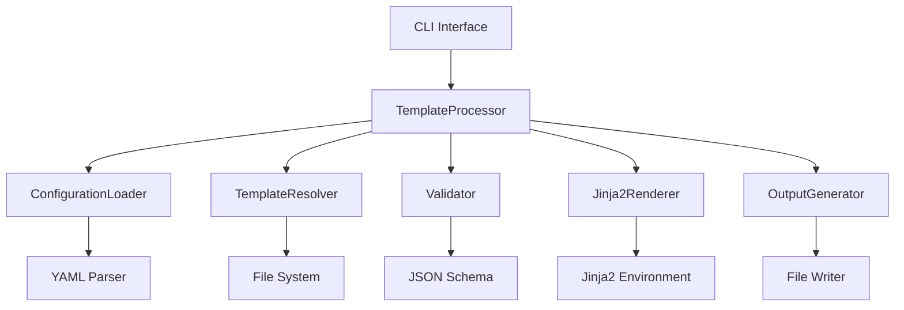

# Stable Flow Process Engine Development Guide

This guide covers the internal architecture and development of Stable Flow's template processing engine. It's intended for core contributors who work on the engine itself.

## Table of Contents

- [Engine Architecture](#engine-architecture)
- [Core Components](#core-components)
- [Processing Pipeline](#processing-pipeline)
- [Configuration System](#configuration-system)
- [Template Resolution](#template-resolution)
- [Error Handling](#error-handling)
- [Performance Optimization](#performance-optimization)
- [Extensibility](#extensibility)

## Engine Architecture

### High-Level Overview

The Stable Flow process engine follows a pipeline architecture:

```
Configuration → Validation → Template Resolution → Processing → Output Generation
       ↓              ↓              ↓              ↓              ↓
   YAML/JSON     Schema Check   File Discovery   Jinja2 Render   File Writing
```

### Component Diagram



## Core Components

### TemplateProcessor Class

The main engine class that orchestrates document generation:

```python
class TemplateProcessor:
    def __init__(self, project_root: Path):
        self.project_root = project_root
        self.templates_dir = project_root / "templates"
        self.source_dir = self.templates_dir / "source"
        self.config_dir = self.templates_dir / "config"
        self.output_dir = project_root / "docs"

        # Initialize Jinja2 environment
        self.jinja_env = Environment(
            loader=FileSystemLoader(str(self.source_dir)),
            trim_blocks=True,
            lstrip_blocks=True
        )

        # Add custom filters
        self.jinja_env.filters.update(self._get_custom_filters())

    def generate_documents(self, config: Dict[str, Any]) -> None:
        """Main entry point for document generation."""
        # Validate configuration
        self._validate_config(config)

        # Determine templates to process
        templates = self._get_templates_for_tier(config)

        # Process each template
        for template_name in templates:
            content = self.process_template(template_name, config)
            if content:
                self._write_output(template_name, content, config)

    def process_template(self, template_name: str, config: Dict[str, Any]) -> Optional[str]:
        """Process a single template."""
        try:
            template = self._load_template(template_name)
            return template.render(**config)
        except Exception as e:
            logger.error(f"Template processing failed for {template_name}: {e}")
            return None
```

### Configuration System

#### Configuration Loading

```python
def load_config(self, config_path: Path) -> Dict[str, Any]:
    """Load and validate configuration from file."""
    if not config_path.exists():
        raise FileNotFoundError(f"Configuration file not found: {config_path}")

    with open(config_path, 'r', encoding='utf-8') as f:
        if config_path.suffix.lower() in ['.yaml', '.yml']:
            config = yaml.safe_load(f)
        elif config_path.suffix.lower() == '.json':
            config = json.load(f)
        else:
            raise ValueError(f"Unsupported config format: {config_path.suffix}")

    # Validate and normalize
    config = self._normalize_config(config)
    self._validate_config(config)

    return config
```

#### Configuration Validation

```python
def _validate_config(self, config: Dict[str, Any]) -> List[str]:
    """Validate configuration against schema."""
    errors = []

    # Required fields
    if 'project' not in config:
        errors.append("Missing required field: project")
    elif not isinstance(config['project'], dict):
        errors.append("project must be an object")

    if 'tier' not in config:
        errors.append("Missing required field: tier")
    elif config['tier'] not in ['minimal', 'core', 'advanced', 'custom']:
        errors.append(f"Invalid tier: {config['tier']}")

    # Tier-specific validation
    if config.get('tier') == 'core':
        if not config.get('sprint_planning', {}).get('team', {}).get('capacity'):
            errors.append("Core tier requires sprint_planning.team.capacity")

    # Cross-field validation
    if config.get('tier') == 'custom':
        if not any(config.get('templates', {}).get('core', {}).values()):
            errors.append("Custom tier requires at least one core template")

    return errors
```

#### Configuration Normalization

```python
def _normalize_config(self, config: Dict[str, Any]) -> Dict[str, Any]:
    """Normalize configuration to standard format."""
    # Set defaults
    config.setdefault('features', {})
    config['features'].setdefault('cascade', False)

    config.setdefault('sections', {})
    config['sections'].setdefault('prd', {})
    config['sections'].setdefault('technical_design', {})

    # Normalize tier
    if config.get('tier') not in ['minimal', 'core', 'advanced', 'custom']:
        config['tier'] = 'minimal'

    return config
```

## Processing Pipeline

### Template Resolution

```python
def _get_templates_for_tier(self, config: Dict[str, Any]) -> List[str]:
    """Determine which templates to process based on tier and config."""
    tier = config['tier']
    templates_config = config.get('templates', {})

    if tier == 'minimal':
        return ['prd-template', 'technical-design-template', 'features-csv-template']

    elif tier == 'core':
        templates = ['prd-template', 'technical-design-template', 'features-csv-template']

        # Add optional core templates
        if templates_config.get('core', {}).get('development_guide', False):
            templates.append('development-guide-template')
        if templates_config.get('core', {}).get('sprint_planning', False):
            templates.append('sprint-planning-template')
        if templates_config.get('core', {}).get('sprint_template', False):
            templates.append('sprint-template')

        return templates

    elif tier == 'advanced':
        templates = self._get_templates_for_tier({**config, 'tier': 'core'})

        # Add advanced templates
        advanced_templates = [
            'master-index-template',
            'adr-template',
            'performance-tracker-template',
            'security-audit-template'
        ]

        # Filter based on configuration
        configured_advanced = templates_config.get('advanced', {})
        for template in advanced_templates:
            base_name = template.replace('-template', '').replace('-', '_')
            if configured_advanced.get(base_name, False):
                templates.append(template)

        return templates

    elif tier == 'custom':
        # Custom tier uses explicit template selection
        return self._get_custom_templates(config)

    return []
```

### Template Loading

```python
def _load_template(self, template_name: str) -> Template:
    """Load template from file system."""
    # Try .md first, then .csv
    for ext in ['.md', '.csv']:
        template_path = f"{template_name}{ext}"
        try:
            return self.jinja_env.get_template(template_path)
        except TemplateNotFound:
            continue

    raise TemplateNotFound(f"No template found for {template_name}")
```

### Content Processing

```python
def process_template(self, template_name: str, config: Dict[str, Any]) -> Optional[str]:
    """Process a single template with full error handling."""
    try:
        # Load template
        template = self._load_template(template_name)

        # Prepare context
        context = self._prepare_context(config)

        # Render template
        content = template.render(**context)

        # Post-process content
        content = self._post_process_content(content, template_name)

        return content

    except TemplateNotFound:
        logger.warning(f"Template not found: {template_name}")
        return None
    except TemplateSyntaxError as e:
        logger.error(f"Template syntax error in {template_name}: {e}")
        return None
    except Exception as e:
        logger.error(f"Unexpected error processing {template_name}: {e}")
        return None
```

### Context Preparation

```python
def _prepare_context(self, config: Dict[str, Any]) -> Dict[str, Any]:
    """Prepare template context with derived values."""
    context = dict(config)  # Copy config

    # Add derived values
    context['timestamp'] = datetime.now().isoformat()
    context['template_version'] = self._get_template_version()

    # Add helper functions
    context['format_date'] = lambda d: d.strftime('%Y-%m-%d') if hasattr(d, 'strftime') else str(d)
    context['pluralize'] = lambda n, singular, plural='': singular if n == 1 else (plural or singular + 's')

    return context
```

### Output Generation

```python
def _write_output(self, template_name: str, content: str, config: Dict[str, Any]) -> None:
    """Write processed content to output file."""
    output_dir = Path(config.get('output', {}).get('directory', 'docs'))
    output_dir.mkdir(exist_ok=True)

    output_path = output_dir / f"{template_name}.md"

    # Add metadata header if requested
    if config.get('output', {}).get('include_metadata', False):
        metadata = self._generate_metadata(template_name, config)
        content = metadata + '\n\n' + content

    # Write file
    with open(output_path, 'w', encoding='utf-8') as f:
        f.write(content)

    logger.info(f"Generated: {output_path}")
```

## Custom Filters and Extensions

### Filter Registration

```python
def _get_custom_filters(self) -> Dict[str, Callable]:
    """Get custom Jinja2 filters."""
    return {
        'strftime': self._strftime_filter,
        'markdown_escape': self._markdown_escape_filter,
        'truncate': self._truncate_filter,
        'percentage': self._percentage_filter,
    }

def _strftime_filter(self, value: Any, format_str: str = '%Y-%m-%d') -> str:
    """Format date/time values."""
    if value == 'now':
        return datetime.now().strftime(format_str)
    elif isinstance(value, (datetime, date)):
        return value.strftime(format_str)
    else:
        return str(value)

def _markdown_escape_filter(self, value: str) -> str:
    """Escape special markdown characters."""
    # Escape markdown special characters
    escapes = {
        '*': '\\*',
        '_': '\\_',
        '`': '\\`',
        '[': '\\[',
        ']': '\\]',
        '(': '\\(',
        ')': '\\)',
    }

    for char, escape in escapes.items():
        value = value.replace(char, escape)

    return value
```

### Extension System

```python
def _setup_extensions(self) -> None:
    """Set up Jinja2 extensions."""
    # Add custom extensions
    self.jinja_env.add_extension('jinja2.ext.do')
    self.jinja_env.add_extension('jinja2.ext.loopcontrols')

    # Add global functions
    self.jinja_env.globals.update({
        'now': datetime.now,
        'enumerate': enumerate,
        'zip': zip,
        'len': len,
    })
```

## Error Handling

### Error Classification

```python
class TemplateError(Exception):
    """Base exception for template processing errors."""
    pass

class ConfigurationError(TemplateError):
    """Configuration-related errors."""
    pass

class TemplateNotFoundError(TemplateError):
    """Template file not found."""
    pass

class RenderingError(TemplateError):
    """Template rendering errors."""
    pass
```

### Error Recovery

```python
def process_template_safe(self, template_name: str, config: Dict[str, Any]) -> Tuple[Optional[str], Optional[str]]:
    """Process template with error recovery."""
    try:
        content = self.process_template(template_name, config)
        return content, None
    except TemplateError as e:
        logger.error(f"Template error in {template_name}: {e}")
        return self._generate_error_template(template_name, str(e)), str(e)
    except Exception as e:
        logger.error(f"Unexpected error in {template_name}: {e}")
        return self._generate_fallback_template(template_name), str(e)

def _generate_error_template(self, template_name: str, error: str) -> str:
    """Generate error template when processing fails."""
    return f"""# Template Error

## Template: {template_name}

**Error:** {error}

This template could not be processed due to a configuration or template error.
Please check your configuration and template files.

## Troubleshooting

1. Verify configuration syntax
2. Check that all required fields are present
3. Ensure template files exist
4. Review error logs for details

Generated at: {datetime.now().isoformat()}
"""

def _generate_fallback_template(self, template_name: str) -> str:
    """Generate minimal fallback template."""
    return f"""# {template_name.replace('-', ' ').title()}

This template could not be fully processed.

Generated at: {datetime.now().isoformat()}
"""
```

## Performance Optimization

### Caching Strategies

```python
class TemplateCache:
    """Cache compiled templates for performance."""

    def __init__(self):
        self._cache: Dict[str, Template] = {}
        self._cache_time: Dict[str, float] = {}

    def get(self, template_name: str, processor: TemplateProcessor) -> Template:
        """Get cached template or load and cache it."""
        cache_key = template_name

        # Check if cache is valid (file not modified)
        template_path = processor.source_dir / f"{template_name}.md"
        if template_path.exists():
            mtime = template_path.stat().st_mtime
            if cache_key in self._cache_time and self._cache_time[cache_key] >= mtime:
                return self._cache[cache_key]

        # Load and cache template
        template = processor._load_template(template_name)
        self._cache[cache_key] = template
        self._cache_time[cache_key] = time.time()

        return template

# Usage in TemplateProcessor
def __init__(self, project_root: Path):
    # ... other initialization ...
    self.template_cache = TemplateCache()

def _load_template(self, template_name: str) -> Template:
    """Load template with caching."""
    if self.use_cache:
        return self.template_cache.get(template_name, self)
    else:
        return super()._load_template(template_name)
```

### Lazy Loading

```python
class LazyTemplateLoader:
    """Lazy load templates only when needed."""

    def __init__(self, source_dir: Path):
        self.source_dir = source_dir
        self._loaded_templates: Dict[str, Template] = {}

    def load_template(self, name: str, env: Environment) -> Template:
        """Load template on demand."""
        if name not in self._loaded_templates:
            template_path = self.source_dir / name
            with open(template_path, 'r', encoding='utf-8') as f:
                source = f.read()
            self._loaded_templates[name] = env.from_string(source)

        return self._loaded_templates[name]
```

### Parallel Processing

```python
import concurrent.futures
from typing import List, Tuple

def generate_documents_parallel(self, config: Dict[str, Any], max_workers: int = 4) -> None:
    """Generate documents using parallel processing."""
    templates = self._get_templates_for_tier(config)

    with concurrent.futures.ThreadPoolExecutor(max_workers=max_workers) as executor:
        # Submit all template processing tasks
        future_to_template = {
            executor.submit(self.process_template, template, config): template
            for template in templates
        }

        # Collect results
        results = []
        for future in concurrent.futures.as_completed(future_to_template):
            template = future_to_template[future]
            try:
                content = future.result()
                results.append((template, content))
            except Exception as e:
                logger.error(f"Failed to process {template}: {e}")
                results.append((template, None))

    # Write outputs (sequential to avoid file conflicts)
    for template, content in results:
        if content:
            self._write_output(template, content, config)
```

## Extensibility

### Plugin Architecture

```python
class TemplatePlugin:
    """Base class for template plugins."""

    def __init__(self, processor: TemplateProcessor):
        self.processor = processor

    def pre_process(self, config: Dict[str, Any]) -> Dict[str, Any]:
        """Modify config before processing."""
        return config

    def post_process(self, content: str, template_name: str) -> str:
        """Modify content after processing."""
        return content

    def get_custom_filters(self) -> Dict[str, Callable]:
        """Provide custom Jinja2 filters."""
        return {}

class GitPlugin(TemplatePlugin):
    """Plugin for Git integration."""

    def pre_process(self, config: Dict[str, Any]) -> Dict[str, Any]:
        """Add Git information to config."""
        try:
            import subprocess
            result = subprocess.run(['git', 'rev-parse', 'HEAD'],
                                  capture_output=True, text=True)
            if result.returncode == 0:
                config['git'] = {
                    'commit': result.stdout.strip(),
                    'branch': self._get_current_branch()
                }
        except Exception:
            pass

        return config

    def _get_current_branch(self) -> str:
        """Get current Git branch."""
        try:
            result = subprocess.run(['git', 'branch', '--show-current'],
                                  capture_output=True, text=True)
            return result.stdout.strip() if result.returncode == 0 else 'unknown'
        except Exception:
            return 'unknown'
```

### Plugin Loading

```python
def load_plugins(self) -> List[TemplatePlugin]:
    """Load available plugins."""
    plugins = []

    # Built-in plugins
    plugins.append(GitPlugin(self))

    # Load external plugins
    plugin_dir = self.project_root / "plugins"
    if plugin_dir.exists():
        for plugin_file in plugin_dir.glob("*.py"):
            try:
                spec = importlib.util.spec_from_file_location(
                    plugin_file.stem, plugin_file)
                module = importlib.util.module_from_spec(spec)
                spec.loader.exec_module(module)

                # Find plugin classes
                for attr_name in dir(module):
                    attr = getattr(module, attr_name)
                    if (isinstance(attr, type) and
                        issubclass(attr, TemplatePlugin) and
                        attr != TemplatePlugin):
                        plugins.append(attr(self))

            except Exception as e:
                logger.warning(f"Failed to load plugin {plugin_file}: {e}")

    return plugins
```

### Custom Template Types

```python
class CustomTemplateType:
    """Support for custom template types beyond Markdown."""

    def __init__(self, extension: str, processor: Callable[[str], str]):
        self.extension = extension
        self.processor = processor

    def process(self, content: str, config: Dict[str, Any]) -> str:
        """Process content with custom logic."""
        return self.processor(content, config)

# Register custom types
custom_types = {
    '.docx': CustomTemplateType('.docx', process_docx),
    '.pdf': CustomTemplateType('.pdf', process_pdf),
    '.json': CustomTemplateType('.json', process_json),
}

def process_template(self, template_name: str, config: Dict[str, Any]) -> Optional[str]:
    """Enhanced template processing with custom types."""
    # Try standard templates first
    content = super().process_template(template_name, config)
    if content:
        return content

    # Try custom template types
    for ext, template_type in custom_types.items():
        try:
            template = self.jinja_env.get_template(f"{template_name}{ext}")
            raw_content = template.render(**config)
            return template_type.process(raw_content, config)
        except TemplateNotFound:
            continue

    return None
```

This guide covers the internal workings of the Stable Flow process engine. Understanding these components is essential for maintaining and extending the core functionality. The engine is designed to be modular, extensible, and performant to handle complex template processing requirements. 🚀</content>
</xai:function_call name="write">
<parameter name="file_path">docs/testing-guide.md

