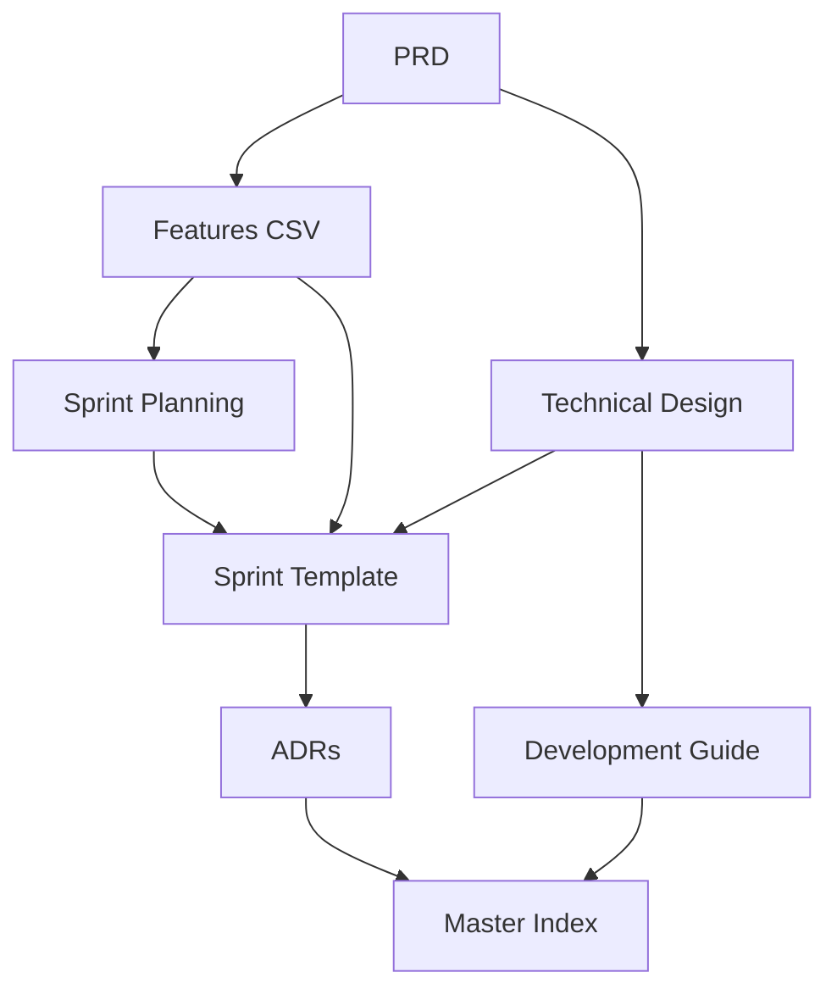

# Master Index Template

## Instructions for Creating a Master Index
1. **Document Mapping**: Create hyperlinks between all template documents
2. **Workflow Definition**: Define the sequence of document creation and updates
3. **Cross-References**: Ensure all documents reference each other appropriately
4. **Version Control**: Track document versions and update dependencies
5. **Team Onboarding**: Use this as a starting point for new team members
6. **Maintenance**: Update links and references when documents change
7. **Tool Integration**: Link to external tools (Jira, GitHub, etc.) where applicable
8. **Search Optimization**: Include keywords for easy document discovery
9. **Access Control**: Define who can edit which documents
10. **Review Cycle**: Establish regular review and update schedules

## Document Information
- **Version**: [Version Number]
- **Last Updated**: [Date]
- **Author**: [Author Name]
- **Project**: [Project Name]

## Document Ecosystem Overview


## Core Documents
### 1. Product Requirements Document (PRD)
- **File**: `docs/PRD.md`
- **Template**: `templates/core/prd-template.md`
- **Purpose**: Product vision, features, and user requirements
- **Dependencies**: None (starting document)
- **Updates**: When product vision or requirements change
- **Links To**: Features CSV, Technical Design, User Stories

### 2. Features CSV
- **File**: `docs/features.csv`
- **Template**: `templates/core/features-csv-template.csv`
- **Purpose**: Detailed feature tracking and prioritization
- **Dependencies**: PRD
- **Updates**: When features are added, modified, or reprioritized
- **Links To**: Sprint Planning, Sprint Template, Technical Design

### 3. Technical Design Document (TDD)
- **File**: `docs/technical-design.md`
- **Template**: `templates/core/technical-design-template.md`
- **Purpose**: Architecture, technology stack, and implementation details
- **Dependencies**: PRD, Features CSV
- **Updates**: When architecture or technology decisions change
- **Links To**: Development Guide, Sprint Template, ADRs

### 4. Development Guide
- **File**: `docs/development-guide.md`
- **Template**: `templates/core/development-guide-template.md`
- **Purpose**: Coding standards, workflows, and best practices
- **Dependencies**: Technical Design
- **Updates**: When coding standards or processes change
- **Links To**: All implementation documents

## Planning Documents
### 5. Sprint Planning Overview
- **File**: `docs/sprint-planning.md`
- **Template**: `templates/core/sprint-planning-template.md`
- **Purpose**: High-level sprint roadmap and resource planning
- **Dependencies**: PRD, Features CSV
- **Updates**: When sprint strategy or resource allocation changes
- **Links To**: Sprint Templates, Features CSV

### 6. Sprint Template
- **File**: `docs/sprints/sprint-[N].md`
- **Template**: `templates/core/sprint-template.md`
- **Purpose**: Individual sprint planning and execution
- **Dependencies**: Sprint Planning, Features CSV, Technical Design
- **Updates**: During sprint execution and retrospectives
- **Links To**: Features CSV, Technical Design, Development Guide

## Advanced Documents
### 7. Architecture Decision Records (ADRs)
- **File**: `docs/adrs/adr-[NNN]-[title].md`
- **Template**: `templates/advanced/adr-template.md`
- **Purpose**: Document significant architectural decisions
- **Dependencies**: Technical Design
- **Updates**: When architectural decisions are made or changed
- **Links To**: Technical Design, Development Guide

## Document Workflow
### Creation Sequence
1. **Start**: PRD (product vision and requirements)
2. **Expand**: Features CSV (detailed feature breakdown)
3. **Design**: Technical Design (architecture and technology)
4. **Plan**: Sprint Planning (high-level roadmap)
5. **Execute**: Sprint Templates (individual sprint execution)
6. **Document**: ADRs (architectural decisions as they arise)

### Update Triggers
- **PRD Changes**: Update Features CSV, Technical Design, Sprint Planning
- **Feature Changes**: Update Sprint Planning, Sprint Templates
- **Architecture Changes**: Update Technical Design, Development Guide, ADRs
- **Process Changes**: Update Development Guide, Sprint Templates

## Cross-Reference Matrix
| Document | PRD | Features | TDD | Dev Guide | Sprint Plan | Sprint | ADR |
|----------|-----|----------|-----|-----------|-------------|--------|-----|
| PRD | - | ✓ | ✓ | - | ✓ | - | - |
| Features | ✓ | - | ✓ | - | ✓ | ✓ | - |
| TDD | ✓ | ✓ | - | ✓ | - | ✓ | ✓ |
| Dev Guide | - | - | ✓ | - | - | ✓ | ✓ |
| Sprint Plan | ✓ | ✓ | - | - | - | ✓ | - |
| Sprint | - | ✓ | ✓ | ✓ | ✓ | - | - |
| ADR | - | - | ✓ | ✓ | - | - | - |

## Tool Integration
### Project Management
- **Jira/Asana**: Link to Features CSV for task tracking
- **GitHub Issues**: Link to Sprint Templates for bug tracking
- **Notion/Confluence**: Use for collaborative document editing

### Development Tools
- **GitHub**: Link to Development Guide for PR templates
- **CI/CD**: Link to Technical Design for deployment configs
- **Monitoring**: Link to Sprint Templates for metrics tracking

### Communication
- **Slack/Teams**: Link to Sprint Templates for daily standups
- **Figma**: Link to PRD for design reviews
- **Miro**: Link to Technical Design for architecture discussions

## Quick Reference
### For Product Managers
- Start with: PRD → Features CSV → Sprint Planning
- Key metrics: Features CSV completion, Sprint velocity

### For Developers
- Start with: Technical Design → Development Guide → Sprint Template
- Key focus: Code quality, architecture adherence

### For AI Agents
- Start with: Development Guide → Technical Design → Sprint Template
- Key focus: Code generation, testing, documentation

### For Project Managers
- Start with: Sprint Planning → Sprint Templates → Features CSV
- Key focus: Timeline, dependencies, risk management

## Maintenance Checklist
### Weekly
- [ ] Update Sprint Template progress
- [ ] Review Features CSV status
- [ ] Check for blocked dependencies

### Monthly
- [ ] Review Sprint Planning roadmap
- [ ] Update Technical Design if needed
- [ ] Validate cross-references

### Quarterly
- [ ] Review all document templates
- [ ] Update tool integrations
- [ ] Assess document effectiveness

## Automated Validation
### Document Health Checks
- **Link Validation**: [GitHub Action to check all internal and external links]
- **Schema Validation**: [JSON Schema validation for structured documents]
- **Dependency Graph**: [Auto-generated dependency visualization from references]
- **Broken Reference Detection**: [Automated detection of missing or outdated references]

### CI/CD Integration
```yaml
# .github/workflows/document-validation.yml
name: Document Validation
on: [push, pull_request]
jobs:
  validate-docs:
    runs-on: ubuntu-latest
    steps:
      - uses: actions/checkout@v3
      - name: Validate Links
        run: |
          # Check all markdown links
          npx markdown-link-check docs/**/*.md
      - name: Validate Schema
        run: |
          # Validate JSON schemas
          npx ajv validate -s schemas/*.json -d docs/**/*.json
      - name: Generate Dependency Graph
        run: |
          # Generate dependency visualization
          python scripts/generate-dependency-graph.py
```

### Change Management
#### RFC Process
- **Proposal Template**: [RFC-XXXX-title.md template]
- **Review Period**: [Minimum 3 days for feedback]
- **Approval Matrix**: [Who approves what types of changes]
- **Implementation Tracking**: [Track RFC implementation status]

#### Version Control Integration
- **Branch Strategy**: [How documentation aligns with code branches]
- **Merge Requirements**: [Documentation updates required with code changes]
- **Release Notes**: [Auto-generated from commit messages and PRs]

### Monitoring & Metrics
#### Document Health Metrics
- **Link Health**: [Percentage of working links]
- **Update Frequency**: [How often documents are updated]
- **Cross-Reference Accuracy**: [Percentage of accurate references]
- **Template Adoption**: [Usage of templates across projects]

#### Team Engagement Metrics
- **Document Views**: [Most accessed documents]
- **Edit Frequency**: [Most actively maintained documents]
- **Search Queries**: [Most searched terms and concepts]
- **Feedback Volume**: [Document improvement suggestions]

## Version History
| Version | Date | Changes | Author |
|---------|------|---------|--------|
| 1.0 | [Date] | Initial template creation | [Author] |
| 1.1 | [Date] | Added tool integration section | [Author] |
| 1.2 | [Date] | Enhanced cross-reference matrix | [Author] |
| 1.3 | [Date] | Added automated validation and change management | [Author] |
