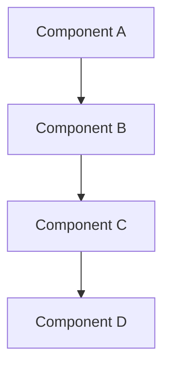
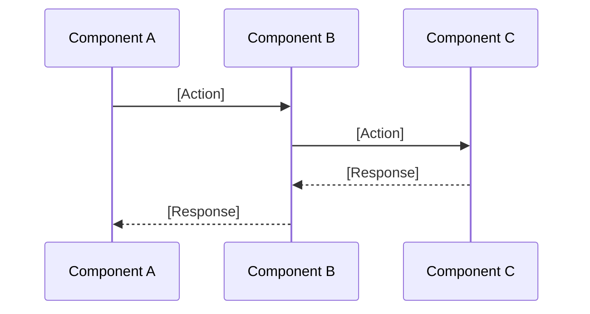
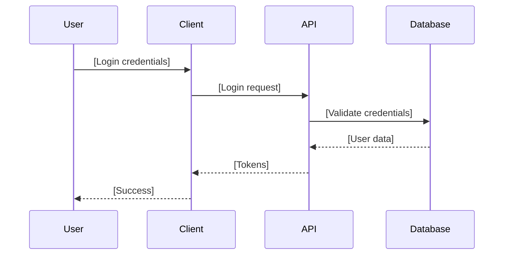
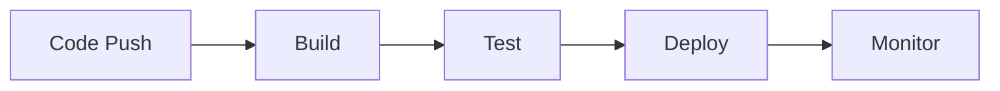

# Technical Design Document Template

## Instructions for Creating a Technical Design
1. **PRD Review**: Review Product Requirements Document to understand business requirements and constraints
2. **Architecture Review**: Review existing system architecture and constraints, if present
3. **Technology Selection**: Choose appropriate technologies based on development guide, requirements and team expertise
4. **Scalability Planning**: Design for current needs and future growth
5. **Security First**: Integrate security considerations from the beginning
6. **Performance Requirements**: Define and plan for performance targets
7. **Integration Points**: Map all internal and external integration requirements
8. **Data Architecture**: Design data models, storage, and processing strategies
9. **Deployment Strategy**: Plan infrastructure, CI/CD, and deployment approach
10. **Monitoring & Observability**: Design comprehensive monitoring and logging
11. **Master Index Update**: If cascade=true in development-guide.md, update master-index.md with any new cross-references or document changes
12. **Documentation**: Ensure all technical decisions are well-documented

## Document Information
- **Version**: [Version Number]
- **Last Updated**: [Date]
- **Author**: [Author Name]
- **Reviewers**: [List of reviewers]

## 1. Architecture Overview
### System Purpose
[Brief description of what the system does]

### Technology Stack
- **Frontend**: [Specific framework version, e.g., React 18 with Vite, State Management: Zustand, Styling: Tailwind CSS]
- **Backend**: [Specific framework and version, e.g., Node.js 18, Express 4.x, TypeScript 5.x]
- **Database**: [Specific database and version, e.g., PostgreSQL 15, Redis 7.x]
- **Infrastructure**: [Specific cloud provider and services, e.g., AWS ECS, RDS, S3]
- **DevOps**: [Specific tools and versions, e.g., Docker, GitHub Actions, Terraform]

### High-Level Architecture


## 2. Core Components
### [Component Name]
- **Purpose**: [What this component does]
- **Key Features**: [Main functionality]
- **Technologies**: [Specific tech used]
- **Interfaces**: [How it communicates]

### [Component Name]
- **Purpose**: [What this component does]
- **Key Features**: [Main functionality]
- **Technologies**: [Specific tech used]
- **Interfaces**: [How it communicates]

## 3. Data Architecture
### Data Flow


### Database Schema
```sql
-- [Table Name] table
CREATE TABLE [table_name] (
    id [TYPE] PRIMARY KEY,
    [column_name] [TYPE] [CONSTRAINTS],
    [column_name] [TYPE] [CONSTRAINTS],
    created_at TIMESTAMP DEFAULT NOW()
);

-- Indexes for performance
CREATE INDEX [index_name] ON [table_name]([column_name]);
```

## 4. Security Design
### Threat Model
#### STRIDE Analysis
- **Spoofing**: [Identity threats and mitigations]
- **Tampering**: [Data integrity threats and mitigations]
- **Repudiation**: [Non-repudiation threats and mitigations]
- **Information Disclosure**: [Data exposure threats and mitigations]
- **Denial of Service**: [Availability threats and mitigations]
- **Elevation of Privilege**: [Authorization threats and mitigations]

#### Attack Surface
- **Entry Points**: [External interfaces, APIs, user inputs]
- **Trust Boundaries**: [System boundaries, data flow boundaries]
- **Data Flows**: [How data moves through the system]

#### Risk Matrix
| Threat | Probability | Impact | Risk Score | Mitigation |
|--------|-------------|--------|------------|------------|
| [Threat 1] | [High/Med/Low] | [High/Med/Low] | [1-9] | [Mitigation strategy] |
| [Threat 2] | [High/Med/Low] | [High/Med/Low] | [1-9] | [Mitigation strategy] |

### Zero Trust Architecture
#### Identity Verification
- **Multi-Factor Authentication**: [MFA requirements and methods]
- **Device Trust**: [Device verification and management]
- **Identity Providers**: [SSO, OAuth, SAML integration]

#### Least Privilege Access
- **Role-Based Access Control (RBAC)**: [Role definitions and permissions]
- **Attribute-Based Access Control (ABAC)**: [Dynamic access decisions]
- **Principle of Least Privilege**: [Minimal required permissions]

#### Micro-segmentation
- **Network Isolation**: [VPC, subnets, security groups]
- **Service Mesh**: [Istio, Linkerd for service communication]
- **API Gateway**: [Rate limiting, authentication, authorization]

### Authentication Flow


### Security Measures
- [Security measure 1]
- [Security measure 2]
- [Security measure 3]

## 5. API Specification
### OpenAPI Definition
- **Specification Version**: OpenAPI 3.1.0
- **Base URL**: [API base URL]
- **Authentication**: [Auth method and requirements]
- **Rate Limiting**: [Rate limits and throttling]

### Contract Testing
- **Consumer-Driven Contracts**: [Pact, Spring Cloud Contract]
- **API Versioning**: [URL path, header, content negotiation]
- **Backward Compatibility**: [Breaking change policies]

### API Endpoints
| Method | Endpoint | Description | Auth Required | Rate Limit |
|--------|----------|-------------|---------------|------------|
| GET | /api/v1/users | List users | Yes | 100/min |
| POST | /api/v1/users | Create user | Yes | 10/min |
| GET | /api/v1/users/{id} | Get user | Yes | 100/min |
| PUT | /api/v1/users/{id} | Update user | Yes | 10/min |
| DELETE | /api/v1/users/{id} | Delete user | Yes | 5/min |

### Error Handling
- **HTTP Status Codes**: [Standard status code usage]
- **Error Response Format**: [Consistent error structure]
- **Retry Logic**: [Exponential backoff, circuit breakers]

## 6. Accessibility & Inclusivity Design
### Compliance Standards
- **Accessibility Standard**: [e.g., WCAG 2.2 AA compliance]
- **Inclusivity Guidelines**: [e.g., diverse user representation in design]
- **Internationalization**: [e.g., multi-language support requirements]

### Implementation Guidelines
- **Frontend Accessibility**: [e.g., ARIA roles, keyboard navigation, screen reader support]
- **API Accessibility**: [e.g., clear error messages, consistent response formats]
- **Data Inclusivity**: [e.g., bias-free data handling, diverse test datasets]

### Testing & Validation
- **Accessibility Testing**: [e.g., automated tools, manual testing procedures]
- **User Testing**: [e.g., diverse user group testing, feedback collection]
- **Compliance Audits**: [e.g., regular accessibility audits, certification requirements]

## 6. Performance & Scalability
### Caching Strategy
- [Caching approach 1]
- [Caching approach 2]
- [Caching approach 3]

### Scaling Approach
- [Scaling strategy 1]
- [Scaling strategy 2]
- [Scaling strategy 3]

### Performance Targets
- [Performance metric 1]: [Target value]
- [Performance metric 2]: [Target value]
- [Performance metric 3]: [Target value]

## 6. Deployment & Operations
### Infrastructure
- [Infrastructure component 1]
- [Infrastructure component 2]
- [Infrastructure component 3]

### CI/CD Pipeline


### Environment Strategy
- **Development**: [Description]
- **Staging**: [Description]
- **Production**: [Description]

### Monitoring & Observability
- [Monitoring tool 1]: [Purpose]
- [Monitoring tool 2]: [Purpose]
- [Monitoring tool 3]: [Purpose]

## 7. Development Guidelines
### Code Organization
```
src/
├── [directory 1]/     # [Purpose]
├── [directory 2]/     # [Purpose]
├── [directory 3]/     # [Purpose]
└── [directory 4]/     # [Purpose]
```

### API Design
- [API design principle 1]
- [API design principle 2]
- [API design principle 3]

### Testing Strategy
- [Testing approach 1]
- [Testing approach 2]
- [Testing approach 3]


## 9. Architectural Decisions & Future Considerations
### Technology Choices & Rationale
- **Database Choice**: [Technology] - **Rationale**: [Why this was chosen over alternatives] - **Future Evolution**: [Migration path or upgrade plan]
- **Framework Choice**: [Technology] - **Rationale**: [Why this was chosen over alternatives] - **Future Evolution**: [Version upgrade strategy]
- **Infrastructure Choice**: [Technology] - **Rationale**: [Why this was chosen over alternatives] - **Future Evolution**: [Scaling or migration considerations]

### Design Patterns & Evolution
- **Pattern 1**: [Pattern name] - **Rationale**: [Why this pattern was chosen] - **Future Considerations**: [How it will evolve]
- **Pattern 2**: [Pattern name] - **Rationale**: [Why this pattern was chosen] - **Future Considerations**: [How it will evolve]
- **Pattern 3**: [Pattern name] - **Rationale**: [Why this pattern was chosen] - **Future Considerations**: [How it will evolve]

### Trade-offs & Future Impact
- **Trade-off 1**: [Description] - **Decision**: [What was chosen] - **Impact**: [Consequences] - **Future Mitigation**: [How to address long-term]
- **Trade-off 2**: [Description] - **Decision**: [What was chosen] - **Impact**: [Consequences] - **Future Mitigation**: [How to address long-term]
- **Trade-off 3**: [Description] - **Decision**: [What was chosen] - **Impact**: [Consequences] - **Future Mitigation**: [How to address long-term]

### Scalability Roadmap
- **Phase 1**: [Current implementation] - **Timeline**: [When]
- **Phase 2**: [Next evolution] - **Timeline**: [When] - **Triggers**: [What drives the change]
- **Phase 3**: [Future state] - **Timeline**: [When] - **Triggers**: [What drives the change]

### Technology Evolution
- **Current Stack**: [What we're using now]
- **Planned Upgrades**: [What we'll upgrade and when]
- **Emerging Technologies**: [What we're monitoring for future adoption]
- **Deprecation Timeline**: [What we'll phase out and when]

## 10. Key Prompts & Directives for AI
### Prompt Iteration Guidelines
**If AI output fails, iterate by adding:**
1. **Specific version constraints**: [e.g., "Use React 19+", "Node.js 18+ only"]
2. **Negative examples**: [e.g., "Avoid deprecated hooks like useMemo", "Don't use var declarations"]
3. **Context expansion**: [e.g., "Reference TDD Section 3.2 for data models"]
4. **Error handling specifics**: [e.g., "Include try-catch for all async operations"]

### Ethical Considerations
- **Bias-free data handling**: [e.g., "Ensure ML components use diverse, representative datasets"]
- **Privacy compliance**: [e.g., "Follow GDPR/CCPA requirements for data processing"]
- **Transparency**: [e.g., "Include clear documentation for AI-generated code decisions"]

### Authentication System (Section 4)
**Primary Prompt**: [Specific prompt for AI implementation]
**Context Files**: [List of relevant files and sections]
**Version Constraints**: [e.g., "Use [framework] version [X]+"]
**Negative Examples**: [e.g., "Avoid [deprecated pattern]"]
**Example**: "Using NodeJS, Express, and Passport.js, create the authentication endpoints as defined in the API spec. The user schema is in Section 3.2. Ensure all passwords are hashed with bcrypt."

### Data Layer (Section 3)
**Primary Prompt**: [Specific prompt for AI implementation]
**Context Files**: [List of relevant files and sections]
**Version Constraints**: [e.g., "Use [ORM] version [X]+"]
**Negative Examples**: [e.g., "Avoid [anti-pattern]"]
**Example**: "Implement the database models using [ORM] as specified in Section 3.2. Follow the schema definitions and ensure proper relationships are established."

### API Layer (Section 2)
**Primary Prompt**: [Specific prompt for AI implementation]
**Context Files**: [List of relevant files and sections]
**Version Constraints**: [e.g., "Use [framework] version [X]+"]
**Negative Examples**: [e.g., "Avoid [deprecated method]"]
**Example**: "Create RESTful API endpoints following the OpenAPI specification in Section 2.3. Implement proper error handling and validation as defined in the Development Guide."

### Frontend Components (Section 2)
**Primary Prompt**: [Specific prompt for AI implementation]
**Context Files**: [List of relevant files and sections]
**Version Constraints**: [e.g., "Use [framework] version [X]+"]
**Negative Examples**: [e.g., "Avoid [deprecated pattern]"]
**Example**: "Build React components using the design system in Section 2.1. Follow the component structure defined in the Development Guide Section 2."