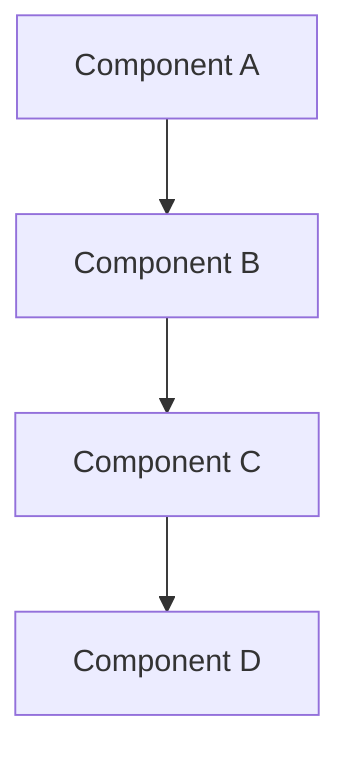
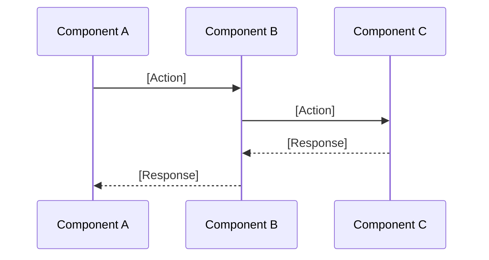
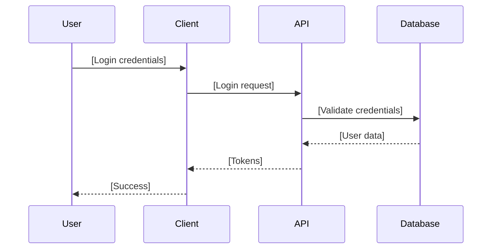
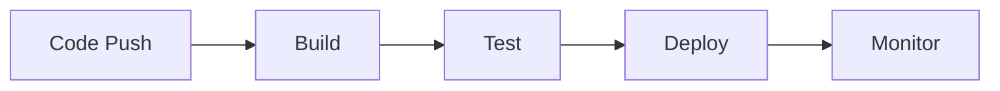

# Technical Design Document Template

## Document Information
- **Version**: [Version Number]
- **Last Updated**: [Date]
- **Author**: [Author Name]
- **Reviewers**: [List of reviewers]

## 1. Architecture Overview
### System Purpose
[Brief description of what the system does]

### Technology Stack
- **Frontend**: [Technologies and frameworks]
- **Backend**: [Technologies and frameworks]
- **Database**: [Database technologies]
- **Infrastructure**: [Cloud providers, containers, etc.]
- **DevOps**: [CI/CD, monitoring, etc.]

### High-Level Architecture


## 2. Core Components
### [Component Name]
- **Purpose**: [What this component does]
- **Key Features**: [Main functionality]
- **Technologies**: [Specific tech used]
- **Interfaces**: [How it communicates]

### [Component Name]
- **Purpose**: [What this component does]
- **Key Features**: [Main functionality]
- **Technologies**: [Specific tech used]
- **Interfaces**: [How it communicates]

## 3. Data Architecture
### Data Flow


### Database Schema
```sql
-- [Table Name] table
CREATE TABLE [table_name] (
    id [TYPE] PRIMARY KEY,
    [column_name] [TYPE] [CONSTRAINTS],
    [column_name] [TYPE] [CONSTRAINTS],
    created_at TIMESTAMP DEFAULT NOW()
);

-- Indexes for performance
CREATE INDEX [index_name] ON [table_name]([column_name]);
```

## 4. Security Design
### Authentication Flow


### Security Measures
- [Security measure 1]
- [Security measure 2]
- [Security measure 3]

## 5. Performance & Scalability
### Caching Strategy
- [Caching approach 1]
- [Caching approach 2]
- [Caching approach 3]

### Scaling Approach
- [Scaling strategy 1]
- [Scaling strategy 2]
- [Scaling strategy 3]

### Performance Targets
- [Performance metric 1]: [Target value]
- [Performance metric 2]: [Target value]
- [Performance metric 3]: [Target value]

## 6. Deployment & Operations
### Infrastructure
- [Infrastructure component 1]
- [Infrastructure component 2]
- [Infrastructure component 3]

### CI/CD Pipeline


### Environment Strategy
- **Development**: [Description]
- **Staging**: [Description]
- **Production**: [Description]

### Monitoring & Observability
- [Monitoring tool 1]: [Purpose]
- [Monitoring tool 2]: [Purpose]
- [Monitoring tool 3]: [Purpose]

## 7. Development Guidelines
### Code Organization
```
src/
├── [directory 1]/     # [Purpose]
├── [directory 2]/     # [Purpose]
├── [directory 3]/     # [Purpose]
└── [directory 4]/     # [Purpose]
```

### API Design
- [API design principle 1]
- [API design principle 2]
- [API design principle 3]

### Testing Strategy
- [Testing approach 1]
- [Testing approach 2]
- [Testing approach 3]

## 8. Future Considerations
### Scalability Roadmap
- **Phase 1**: [Description]
- **Phase 2**: [Description]
- **Phase 3**: [Description]

### Technology Evolution
- [Technology consideration 1]
- [Technology consideration 2]
- [Technology consideration 3]
